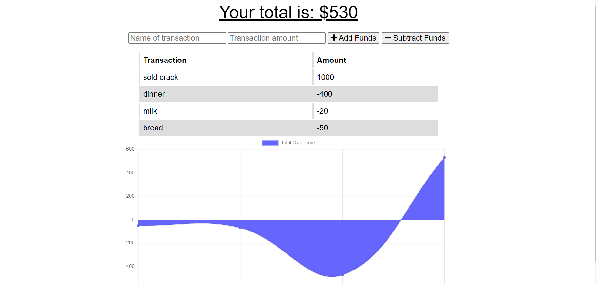

# Budget Tracker

A budget tracker app that allows the user to add expenses and make deposits while giving the user a money balance. The app is available offline and will still have full functionality.

[Heroku Deployment](https://shrouded-citadel-92853.herokuapp.com/)

## Demo

<!--  -->

## Screenshot

<!--  -->

# Built with

[Express.js](https://expressjs.com/)

[MongoDB](https://www.mongodb.com/)

[Mongoose](https://mongoosejs.com/docs/)

# Contribution

Erik Williams
